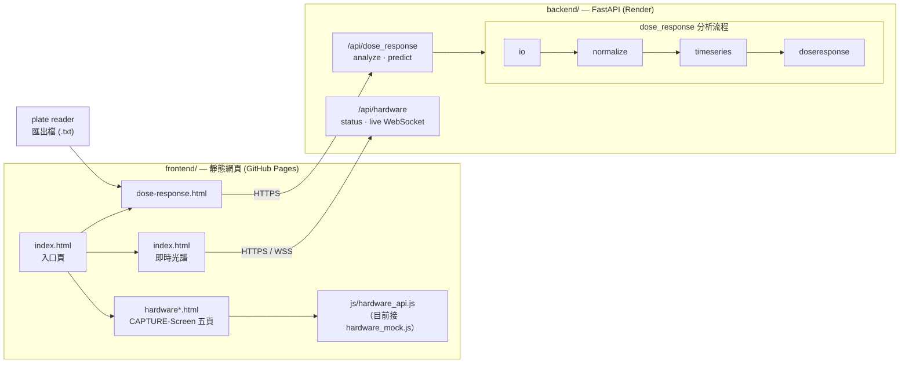

# LasReader

成大 iGEM（NCKU-Tainan 2026 · Capture）的濕實驗資料工具，前後端分離的網頁應用。

- **AHL 劑量反應分析** — 上傳 plate reader 原始匯出檔，自動跑完整條分析流程，算出每株菌的 EC50、Hill 係數、95% 信賴區間、R²、LOD/LOQ，並判斷該菌株對 AHL 到底有沒有反應。
- **CAPTURE-Screen 硬體介面** — 隊上自製的 AS7341 螢光讀取儀：首頁可透過 FastAPI WebSocket 即時顯示十個光譜通道；儀器狀態、逐管校正、4PL 擬合與量測流程目前仍以瀏覽器端 mock／localStorage 執行。

前端是純靜態網頁（部署在 GitHub Pages），後端是 FastAPI（部署在 Render），兩邊只透過 HTTP/CORS 溝通，沒有共用的建置流程。

授權：[MIT License](LICENSE)。

## 系統架構



## 專案結構

```
frontend/                     純靜態網頁，無框架、無 build step
├── index.html                入口頁：功能卡片與即時 AS7341 光譜
├── dose-response.html        劑量反應分析頁
├── hardware.html             CAPTURE-Screen：儀器狀態（硬體區首頁）
├── hardware-measure.html     CAPTURE-Screen：量測未知樣品
├── hardware-calibration.html CAPTURE-Screen：校正 run（依 slot 逐管量測）
├── hardware-calibration-fit.html  CAPTURE-Screen：4PL 擬合、排除、存檔
├── hardware-curves.html      CAPTURE-Screen：曲線列表
├── css/style.css
└── js/                       config / dose_response / backend_status
                              hardware_mock → hardware_api → hardware_common → 各頁 script

backend/                      FastAPI
├── app/
│   ├── main.py               掛載各功能 router
│   ├── config.py             環境變數與 CORS 設定
│   ├── hardware/             CAPTURE-Screen 狀態與即時 WebSocket
│   └── dose_response/        劑量反應分析（本專案的主要運算）
├── tests/                    pytest
└── requirements.txt

scripts/                      安裝與啟動腳本（.sh 與 .ps1 兩版）
docs/dose_response_model_spec.md   劑量反應模型的實作規格書
```

## 快速開始

需求：Python 3.10 以上。前端沒有任何依賴，不需要 Node.js。

### 用腳本（建議）

在 repo 根目錄執行。第一次先跑 setup 裝好後端環境，之後每次開發只要跑 dev。

```bash
# macOS / Linux / Windows Git Bash
bash scripts/setup.sh
bash scripts/dev.sh
```

```powershell
# Windows PowerShell
powershell -ExecutionPolicy Bypass -File scripts\setup.ps1
powershell -ExecutionPolicy Bypass -File scripts\dev.ps1
```

`dev` 會同時啟動後端 http://127.0.0.1:8000 （API 文件在 `/docs`）與前端 http://127.0.0.1:5500 ，按 Ctrl+C 兩個一起關掉。

### 手動步驟

如果不想用腳本，或想只跑其中一邊：

```bash
# 後端
cd backend
python -m venv .venv
.venv\Scripts\activate          # Windows；macOS/Linux 用 source .venv/bin/activate
pip install -r requirements.txt
uvicorn app.main:app --reload

# 前端（另開一個終端機）
cd frontend
python -m http.server 5500
```

> `main.py` 位在 `app` 套件裡面，所以**只能**用 `uvicorn app.main:app` 啟動。直接 `python main.py` 或 `uvicorn main:app` 都會失敗。

前端的 port 建議維持 5500：後端的 CORS 白名單預設就包含它（見 `backend/app/config.py`，或用 `backend/.env` 覆寫）。前端會依網址自動選後端 — `localhost` / `127.0.0.1` 打本機的 `http://127.0.0.1:8000`，其他一律打線上的 Render 網址。這個判斷集中在 [`frontend/js/config.js`](frontend/js/config.js)，換網址只要改那一行。

### 測試

```bash
cd backend
pytest
```

`tests/conftest.py` 會把 `backend/` 加進 `sys.path`，所以 `pytest` 要在 `backend/` 目錄下執行。

## API

後端網址：`https://igem-ncku-software.onrender.com`

| Method | Path | 說明 |
|---|---|---|
| `GET` | `/health` | 健康檢查，前端頁尾的連線指示燈在打這支 |
| `POST` | `/api/dose_response/analyze` | 上傳 reader 匯出檔（multipart），回傳每株菌的擬合結果 |
| `POST` | `/api/dose_response/predict` | 由螢光值反推 AHL 濃度 |

完整的請求/回應 schema 可以在後端啟動後開 `/docs` 互動式查看。

`/analyze` 每株菌回傳 `ec50_nM`、`ec50_nM_ci95`、`n`、`top`、`bottom`、`r_squared`、`responsive`、`p_value`、`lod_nM`、`loq_nM`，外加畫圖用的 `plateau_points` 與 `fit_curve`。

兩點設計上的取捨：

- **平坦檢定判定為沒有反應的菌株，`ec50_nM` 和 `fit_curve` 會是 `null`**，不會硬給一個假的數字。前端據此決定不畫曲線、也不提供反推工具。
- **`/predict` 是無狀態的**：由前端把 `/analyze` 拿到的 Hill 參數原樣送回來，後端不記憶任何 session。

## 劑量反應分析流程

`app/dose_response/` 按照 [`docs/dose_response_model_spec.md`](docs/dose_response_model_spec.md) 實作，一個階段一個模組：

```
io.py            解析 SpectraMax ASCII 匯出檔 → well / time_h / RFU / OD600 整齊表
normalize.py     扣 blank，做 OD 門檻過濾與螢光正規化
timeseries.py    合併重複組，擬合時間軸 logistic，取出 plateau
doseresponse.py  Hill 擬合（lmfit）、平坦檢定、LOD/LOQ
models.py        純數學式（Hill、logistic），不碰 I/O
pipeline.py      串起以上四步
router.py        只做 HTTP 轉接，不含任何運算
```

純數學（`models.py`）刻意跟資料處理分開，所以可以單獨用合成資料做單元測試，不需要真實的實驗數據。

程式裡幾乎每個函式的 docstring 都標了 `(spec §N)`，對應規格書的章節。**要改分析行為前請先讀對應的規格章節** — 這份程式碼是刻意照著規格書寫的。

### 實驗設計與門檻值

盤面配置（哪一列是哪個濃度、哪幾行是哪株菌）、blank/positive 井位、以及各種門檻值，全部集中在 [`backend/app/dose_response/config/experiment.yaml`](backend/app/dose_response/config/experiment.yaml)。

設計 v.1 的配置：

- **AHL 濃度**（3-oxo-C12-HSL），A–F 列：0、1 nM、10 nM、100 nM、1 µM、10 µM
- **菌株**：TOP10（1–3 行）、DH5α（4–6 行）、BL21（7–9 行）
- **G 列** blank，**H1–H3** positive control
- **讀值**：OD600 + GFP（Ex/Em 485/510 nm），每小時一次

換盤面配置或調門檻值請改這個 YAML，不要去改各模組裡的數字。

### 換一台 plate reader

`io.py` 的 `load_reader_export()` 是唯一知道 SpectraMax ASCII 匯出格式長什麼樣的地方（adapter pattern）。下游全部只吃 well / time_h / RFU / OD600 的整齊表，所以要支援另一台儀器，只需要新增一個對應的 `load_*_export()`，其餘模組都不用動。

## 硬體

CAPTURE-Screen 是隊上自製的螢光讀取儀，用 AS7341 光譜感測器讀 sfGFP 螢光。首頁的即時光譜已由 `backend/app/hardware/` 提供 `GET /api/hardware/status` 與 `WS /api/hardware/live`。後端預設使用 mock 串流，因此沒開硬體也能測試；設為 `HARDWARE_MODE=device` 時則代理同一區網內 ESP32 的 `/status` 與 `/live`。

雲端 Render 無法主動連入實驗室區網裡的 `capture-screen.local`。真實裝置模式需要在同一區網的電腦上啟動後端，或另行建立安全的裝置上行／網路通道。

五個硬體工作流程頁面的 plan、curve、fit、invert 目前仍由 `hardware_local.js` 存在瀏覽器 localStorage，尚未移到後端資料庫；這與首頁的即時串流是兩個獨立範圍。

| 頁面 | 用途 |
|---|---|
| `hardware.html` | 連線狀態、組態與 fingerprint、active 曲線摘要、Dark read / Blank read 自我檢查 |
| `hardware-calibration.html` | 建立校正清單，依 slot 順序逐管量測（只有一支 cuvette，「下一管」固定顯示在頂端） |
| `hardware-calibration-fit.html` | 4PL 擬合、排除個別管（必須附理由）、存檔並設為 active |
| `hardware-measure.html` | 量測樣品，經 active 曲線反推濃度與 95% CI |
| `hardware-curves.html` | 所有曲線，標示 active / available / stale |

前端分三層，接真後端時只需要換掉 API 層：

- `js/device_live.js` — 首頁透過後端狀態 API 與 WebSocket 顯示十個 AS7341 raw channels，不儲存即時 frame。
- `js/hardware_api.js` — 五個工作流程頁面唯一呼叫的介面，也用 JSDoc 定義未來儲存後端的資料契約（`Measurement`、`CalibrationPlan`、`CalibrationCurve`、`InverseEstimate` 等）。
- `js/hardware_mock.js` — 模擬儀器與後端：以 4PL 真值模型加 3% 比例噪音與 8 counts 加成噪音產生讀值，並實作加權 4PL 擬合、LOD/LOQ、反推與 CI。狀態存在瀏覽器的 localStorage。
- `js/hardware_mock_panel.js` — 每個硬體頁面底部的「Mock controls」，用來觸發極低 / 極高訊號、組態變更、離線等邊界狀況。接上後端時與 `hardware_mock.js` 一起移除。

### 即時串流後端設定

設定寫在 `backend/.env`；可從 `.env.example` 複製：

```dotenv
# 沒有硬體也能測試
HARDWARE_MODE=mock
HARDWARE_DEVICE_BASE_URL=http://capture-screen.local
```

接真實 ESP32 時，把 `HARDWARE_MODE` 改為 `device`；後端必須和裝置在同一區網。

瀏覽器連線後先收到 `{"mode":"state","state":"IDLE"}`。送出 `{"cmd":"live_start"}` 後，後端持續推送與韌體相同格式的 `mode: "live"` frame；送出 `live_stop` 即停止。

兩條不能破的規則：反推結果不是 `ok` 時**不顯示任何數字濃度**（範圍外絕不外插）；頁面上**不得出現診斷、檢測病原菌或定量 AHL 等宣稱**，只保留頁尾的 RUO 標示。

## 如何擴充

**新增一個後端功能**：在 `backend/app/` 底下開一個資料夾，裡面放自己的 `router.py`（定義一個帶專屬 path prefix 的 `APIRouter`），運算邏輯放同層的其他模組，最後在 `app/main.py` 加一行 `include_router()`。沒有共用基底類別或外掛註冊機制，就是手動接上去。請不要把路由直接寫進 `main.py`。

**新增一個前端頁面**：在 `frontend/` 加一個 `.html`，載入 `js/config.js`（一定要排最前面，它定義 `BACKEND_BASE_URL`）再載入該頁自己的 script，然後從 `index.html` 連過去。每支 script 只負責自己的頁面、彼此不互相呼叫，唯一的共用點就是 `BACKEND_BASE_URL`。例外是 CAPTURE-Screen 的五個硬體頁面：它們共用 `hardware_api.js` 與 `hardware_common.js`（見上方〈硬體〉一節）。部署不用改設定 — GitHub Actions 是把整個 `frontend/` 原樣上傳。

## 相依套件

**後端**（`backend/requirements.txt`）：FastAPI、uvicorn、pydantic、python-multipart、python-dotenv、numpy、scipy、pandas、lmfit、pyyaml；測試用 pytest、httpx。

**前端**：只有 [Chart.js](https://www.chartjs.org/) 4.4.1，從 cdnjs 以 `<script>` 載入，沒有 vendored 進 repo，也沒有 npm 工具鏈。

## 部署

- **前端**：push 到 `main` 就會由 [`.github/workflows/deploy-pages.yml`](.github/workflows/deploy-pages.yml) 把整個 `frontend/` 資料夾原樣推上 GitHub Pages，中間沒有任何建置或轉換步驟，新增檔案會自動被帶上。
- **後端**：部署在 Render，設定在這個 repo 之外。要讓新的前端來源能呼叫後端，得把該 origin 加進 `CORS_ORIGINS`（見 [`backend/app/config.py`](backend/app/config.py) 的預設值，或用環境變數覆蓋）。

## 授權

本專案採用 [MIT License](LICENSE)，為 OSI 認可的開源授權。
