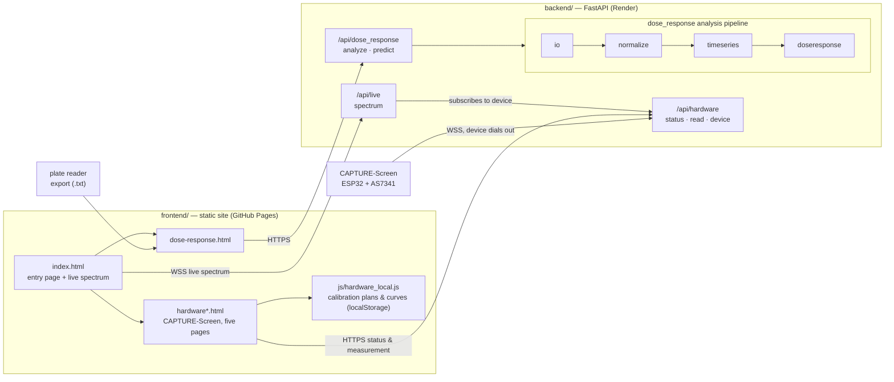

# LasReader

Wet-lab data tools for NCKU-Tainan iGEM 2026 (Capture): a frontend/backend-split web application.

- **AHL dose-response analysis** — upload a raw plate reader export, run the whole analysis pipeline automatically, and get each strain's EC50, Hill coefficient, 95% confidence interval, R², LOD/LOQ, and whether that strain responds to AHL at all.
- **CAPTURE-Screen hardware interface** — the team's own AS7341 fluorescence reader: once the device powers on and joins Wi-Fi it connects itself to the backend, the landing page shows all ten spectral channels live, and the other pages go through the backend for instrument checks, per-tube calibration, 4PL fitting, and measurement. Everything shown is a real reading from the device — no simulated data; calibration plans and curves currently live in the browser's localStorage.

The frontend is a plain static site (deployed on GitHub Pages), the backend is FastAPI (deployed on Render), and the two talk over HTTP/CORS and WebSocket — there's no shared build step.

License: [MIT License](LICENSE).

## Architecture



## Project structure

```
frontend/                     plain static site, no framework, no build step
├── index.html                entry page: feature cards + live AS7341 spectrum
├── dose-response.html        dose-response analysis page
├── hardware.html             CAPTURE-Screen: instrument status (hardware section home)
├── hardware-measure.html     CAPTURE-Screen: measure an unknown sample
├── hardware-calibration.html CAPTURE-Screen: calibration run (measure tube-by-tube by slot)
├── hardware-calibration-fit.html  CAPTURE-Screen: 4PL fit, exclusions, save
├── hardware-curves.html      CAPTURE-Screen: curve list
├── css/style.css
└── js/                       config / dose_response / backend_status / device_live
                              hardware_processing → hardware_local → hardware_api → hardware_common → each page's script

backend/                      FastAPI
├── app/
│   ├── main.py               mounts each feature's router
│   ├── config.py             environment variables and CORS settings
│   ├── hardware/             CAPTURE-Screen's relay: device connection, status, measurement
│   ├── live/                 live sensing: browsers watch the live spectrum, relayed to the device through hardware's connection
│   └── dose_response/        dose-response analysis (this project's main computation)
├── tests/                    pytest
└── requirements.txt

firmware/as7341/              CAPTURE-Screen firmware (ESP32 + AS7341 + OLED)
scripts/                      install and run scripts (.sh and .ps1 versions)
docs/dose_response_model_spec.md   implementation spec for the dose-response model
```

## Quickstart

Requirements: Python 3.10+. The frontend has no dependencies and doesn't need Node.js.

### Using the scripts (recommended)

Run from the repo root. Run setup once to set up the backend environment, then dev every time after that.

```bash
# macOS / Linux / Windows Git Bash
bash scripts/setup.sh
bash scripts/dev.sh
```

```powershell
# Windows PowerShell
powershell -ExecutionPolicy Bypass -File scripts\setup.ps1
powershell -ExecutionPolicy Bypass -File scripts\dev.ps1
```

`dev` starts the backend at http://127.0.0.1:8000 (API docs at `/docs`) and the frontend at http://127.0.0.1:5500 together; Ctrl+C shuts both down.

### Manual steps

If you'd rather not use the scripts, or only want to run one side:

```bash
# Backend
cd backend
python -m venv .venv
.venv\Scripts\activate          # Windows; macOS/Linux use source .venv/bin/activate
pip install -r requirements.txt
uvicorn app.main:app --reload

# Frontend (in another terminal)
cd frontend
python -m http.server 5500
```

> `main.py` lives inside the `app` package, so it can **only** be started with `uvicorn app.main:app`. Running `python main.py` or `uvicorn main:app` directly will fail.

Keep the frontend on port 5500 if possible: the backend's CORS allowlist already includes it by default (see `backend/app/config.py`, or override via `backend/.env`). The frontend picks its backend automatically based on the URL — `localhost` / `127.0.0.1` hits the local `http://127.0.0.1:8000`, everything else hits the live Render URL. That check lives in one place, [`frontend/js/config.js`](frontend/js/config.js); changing the URL only means editing that one line.

### Tests

```bash
cd backend
pytest
```

`tests/conftest.py` adds `backend/` to `sys.path`, so `pytest` must be run from inside `backend/`.

## API

Backend URL: `https://igem-ncku-software.onrender.com`

| Method | Path | Description |
|---|---|---|
| `GET` | `/health` | Health check; the frontend footer's connection indicator polls this |
| `POST` | `/api/dose_response/analyze` | Upload a reader export (multipart), returns each strain's fitted results |
| `POST` | `/api/dose_response/predict` | Back-calculates AHL concentration from a fluorescence value |
| `GET` | `/api/hardware/status` | Whether CAPTURE-Screen is online, its last reported status and config |
| `POST` | `/api/hardware/read` | Asks the device to take one measurement (dark → light → dark), returns the raw reading |
| `WS` | `/api/hardware/device` | The device's own inbound connection |
| `WS` | `/api/live/spectrum` | Browsers watching the live spectrum |

The full request/response schema can be explored interactively at `/docs` once the backend is running.

`/analyze` returns `ec50_nM`, `ec50_nM_ci95`, `n`, `top`, `bottom`, `r_squared`, `responsive`, `p_value`, `lod_nM`, `loq_nM` per strain, plus `plateau_points` and `fit_curve` for plotting.

Two deliberate design choices:

- **When the flatness test decides a strain doesn't respond, `ec50_nM` and `fit_curve` come back `null`** rather than a fake number. The frontend uses this to decide not to draw a curve or offer the inversion tool.
- **`/predict` is stateless**: the frontend sends back the Hill parameters it got from `/analyze` as-is; the backend keeps no session.

## Dose-response analysis pipeline

`app/dose_response/` is implemented per [`docs/dose_response_model_spec.md`](docs/dose_response_model_spec.md), one module per stage:

```
io.py            parses a SpectraMax ASCII export -> a tidy well / time_h / RFU / OD600 table
normalize.py     subtracts blanks, applies OD gating and fluorescence normalization
timeseries.py    collapses replicates, fits the time-axis logistic, extracts the plateau
doseresponse.py  Hill fit (lmfit), flatness test, LOD/LOQ
models.py        pure math (Hill, logistic) — no I/O
pipeline.py      chains the four steps above together
router.py        thin HTTP adapter only, no computation of its own
```

The pure math (`models.py`) is deliberately kept separate from data handling, so it can be unit-tested against synthetic data alone, without needing real experimental data.

Almost every function's docstring in this code is tagged with `(spec §N)`, pointing at the corresponding section of the spec. **Read the referenced spec section before changing analysis behavior** — this code is a deliberate transcription of that spec.

### Experiment design and thresholds

The plate layout (which row is which concentration, which columns are which strain), blank/positive well positions, and every threshold are centralized in [`backend/app/dose_response/config/experiment.yaml`](backend/app/dose_response/config/experiment.yaml).

Design v.1's layout:

- **AHL concentration** (3-oxo-C12-HSL), rows A-F: 0, 1 nM, 10 nM, 100 nM, 1 µM, 10 µM
- **Strains**: TOP10 (columns 1-3), DH5α (columns 4-6), BL21 (columns 7-9)
- **Row G** blank, **H1-H3** positive control
- **Readings**: OD600 + GFP (Ex/Em 485/510 nm), once per hour

To change the plate layout or a threshold, edit this YAML — don't change the numbers inside individual modules.

### Supporting a different plate reader

`io.py`'s `load_reader_export()` is the only place that knows what a SpectraMax ASCII export looks like (an adapter pattern). Everything downstream only consumes the tidy well / time_h / RFU / OD600 table, so supporting a different instrument just means adding a matching `load_*_export()` — no other module needs to change.

## Hardware

CAPTURE-Screen is the team's own fluorescence reader: an ESP32 plus an AS7341 spectral sensor, reading sfGFP fluorescence. Everything shown on the web pages is a real reading from the device — there is no simulated data anywhere; when the device is off, the page shows it as offline directly.

### How the device connects to the software

The backend runs on Render and can't reach a device behind a lab or home router, so the direction is reversed: once the device powers on and joins Wi-Fi, it dials out to `wss://igem-ncku-software.onrender.com/api/hardware/device` itself and keeps that connection open, reconnecting automatically if it drops. Web pages only ever talk to the backend, which relays over that connection to the device:

- **Live spectrum** (landing page): turning on the Live switch has the backend tell the device to turn on its LED and stream frame after frame (the DFRobot library takes about 1 s to read all ten channels, so roughly one frame per second); once the last viewer turns Live off or leaves the page, the backend tells the device to turn the LED off. The LED stays lit only while someone is watching, since leaving it on would heat and bleach the sample.
- **Measurement** (instrument check, calibration, Measure): the page sends `POST /api/hardware/read`, the device runs one dark → light → dark cycle (about 3 s), and the backend hands the raw reading back to the page; dark subtraction, normalization, and unmixing all happen on the web side (`js/hardware_processing.js`). Live streaming pauses during a measurement and resumes automatically afterward.

This connection currently has no authentication: anyone who knows the URL could impersonate the device or trigger a measurement. A shared secret is planned for later.

### Flashing the firmware

1. Install ESP32 board support in the Arduino IDE, plus the libraries DFRobot_AS7341, Adafruit SSD1306, Adafruit GFX, ArduinoJson (7.x), and WebSockets (Markus Sattler). Verified to compile against: ESP32 core 3.3.8, DFRobot_AS7341 1.0.0, Adafruit SSD1306 2.5.17, Adafruit GFX 1.12.6, ArduinoJson 7.4.3, WebSockets 2.7.2.
2. Copy `firmware/as7341/secrets.h.example` to `secrets.h` in the same folder, and fill in your Wi-Fi name and password (ESP32 only supports 2.4 GHz). `secrets.h` is already excluded by `.gitignore`.
3. Open `firmware/as7341/as7341.ino`, select the ESP32 Dev Module board, and flash it.
4. The OLED showing `Backend: online` means it's connected, and the landing page's Live card will show `CAPTURE-Screen online`. If it won't connect, open the Serial Monitor (115200) — lines starting with `[wifi]` and `[backend]` explain where it's stuck.

The Render free tier sleeps after a period of inactivity and can take tens of seconds to wake up; the device keeps retrying on its own during that time, no need to reflash or restart it.

### Connecting the device during local development

The backend needs to be reachable from a device on the local network: run `uvicorn app.main:app --host 0.0.0.0 --port 8000` from `backend/`, then in `secrets.h` uncomment `BACKEND_HOST` (filled in with this computer's LAN IP), `BACKEND_PORT 8000`, and `BACKEND_USE_TLS 0`, and reflash.

### Pages

Calibration plans, curves, fitting, and inversion currently live in the browser's localStorage via `hardware_local.js`, not yet moved to a backend database.

| Page | Purpose |
|---|---|
| `hardware.html` | Connection status, config and fingerprint, active curve summary, Dark read / Blank read self-checks |
| `hardware-calibration.html` | Creates a calibration list, measures tube-by-tube in slot order (only one cuvette, so "next tube" is pinned at the top) |
| `hardware-calibration-fit.html` | 4PL fit, excludes individual tubes (a reason is required), saves and sets active |
| `hardware-measure.html` | Measures a sample, inverts through the active curve to a concentration with a 95% CI |
| `hardware-curves.html` | Every curve, marked active / available / stale |

The frontend is layered so that once a storage backend exists, only the API layer needs to change:

- `js/hardware_processing.js` — pure functions: raw device reading → `Measurement` (dark subtraction, normalization, saturation check, unmixing, QC flags, config fingerprint).
- `js/hardware_local.js` — temporary storage for calibration plans and curves, weighted 4PL fitting, LOD/LOQ, inversion with a 95% CI.
- `js/hardware_api.js` — the one interface all five pages call: anything device-related goes through the backend, everything else through `hardware_local.js`; also defines the data contract via JSDoc (`Measurement`, `CalibrationPlan`, `CalibrationCurve`, `InverseEstimate`, etc.).
- `js/device_live.js` — the landing page's live spectrum: a ten-channel bar chart of the latest frame. Display only, never stores any live frame.

### Backend configuration

`backend/.env` (can be copied from `.env.example`):

```dotenv
# How long without a message from the device before it's considered offline (firmware reports every 5 s)
HARDWARE_ONLINE_TIMEOUT_SECONDS=15
# Upper bound on waiting for one measurement result (a measurement itself takes about 3 s)
HARDWARE_READ_TIMEOUT_SECONDS=10
```

Two rules that must never be broken: **no numeric concentration is ever shown** unless the inversion result is `ok` (never extrapolate outside the range); and the pages **must never contain diagnostic claims, pathogen-detection wording, or a claim to quantify AHL** — the only exception is the required RUO footer line.

## Extending the project

**Adding a backend feature**: create a folder under `backend/app/` containing its own `router.py` (defining an `APIRouter` with its own path prefix), put the computation logic in other modules alongside it, then add one `include_router()` line in `app/main.py`. There's no shared base class or plugin registry — it's wired in by hand. Please don't add routes directly to `main.py`.

**Adding a frontend page**: add an `.html` file under `frontend/`, load `js/config.js` first (it must come before everything else, since it defines `BACKEND_BASE_URL`), then that page's own script, and link to it from `index.html`. Each script only handles its own page and never calls another; the only thing they share is `BACKEND_BASE_URL`. The exception is CAPTURE-Screen's five hardware pages, which share `hardware_api.js` and `hardware_common.js` (see the Hardware section above). No deployment config changes are needed — GitHub Actions just uploads the whole `frontend/` folder as-is.

## Dependencies

**Backend** (`backend/requirements.txt`): FastAPI, uvicorn, websockets (needed for uvicorn to handle WebSockets), pydantic, python-multipart, python-dotenv, numpy, scipy, pandas, lmfit, pyyaml; pytest and httpx for testing.

**Firmware** (Arduino Library Manager): DFRobot_AS7341, Adafruit SSD1306, Adafruit GFX, ArduinoJson 7, WebSockets (Markus Sattler).

**Frontend**: only [Chart.js](https://www.chartjs.org/) 4.4.1, loaded via `<script>` from cdnjs — not vendored into the repo, and no npm toolchain.

## Deployment

- **Frontend**: pushing to `main` has [`.github/workflows/deploy-pages.yml`](.github/workflows/deploy-pages.yml) upload the whole `frontend/` folder as-is to GitHub Pages, with no build or transform step in between — new files are picked up automatically.
- **Backend**: deployed on Render, configured outside this repo. To let a new frontend origin call the backend, add that origin to `CORS_ORIGINS` (see the defaults in [`backend/app/config.py`](backend/app/config.py), or override via an environment variable).

## License

This project is released under the [MIT License](LICENSE), an OSI-approved open-source license.
