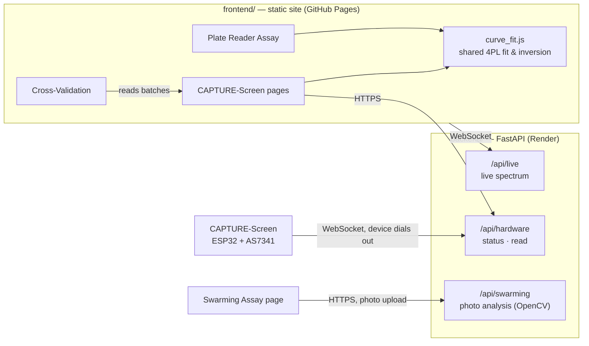

# LasReader

**Wet-lab data tools of iGEM NCKU-Tainan 2026 (Capture).** LasReader turns the fluorescence of an AHL biosensor into an inferred AHL concentration with a 95% confidence interval: on any plate reader, on CAPTURE-Screen (the team's own low-cost fluorescence reader), and across the two.

| | |
|---|---|
| **Team** | [NCKU-Tainan, iGEM 2026](https://2026.igem.wiki/ncku-tainan/) — wiki [Software](https://2026.igem.wiki/ncku-tainan/software) and [Hardware](https://2026.igem.wiki/ncku-tainan/hardware) pages |
| **Source code** | <https://gitlab.igem.org/2026/software/ncku-tainan/lasreader> |
| **Live app** | <https://igem-ncku-software.github.io/igem-software/> (a convenience copy; everything needed to run LasReader is in this repository) |
| **License** | [MIT](LICENSE) |

> **Research use only.** LasReader reports AHL concentrations *inferred* from a calibration curve. It is not intended for diagnostic use.

## What it does

A biosensor that reports AHL through a fluorescent protein gives a signal, not a concentration. Getting a concentration you can trust means subtracting backgrounds, combining replicates, fitting a standard curve and respecting its limits. LasReader does those steps in three browser tools, with nothing to install:

| Tool | For | Result |
|---|---|---|
| **Plate Reader Assay** | Any plate reader | AHL standards and samples from one plate are typed, pasted from Excel, or imported as the reader's 8 × 12 export. A weighted 4PL standard curve is fitted and each sample's AHL is inferred with a 95% CI, scaled by its dilution. Optional normalization to OD600. |
| **CAPTURE-Screen** | The team's reader (ESP32 + AS7341) | A live spectrum, then four pages used in order: check the instrument → calibrate tube by tube → review curves → measure samples in replicate. |
| **Cross-Validation** | Both | The same samples from both instruments, paired by name: a log-log plot, the geometric mean ratio and Bland–Altman 95% limits of agreement. |

Apart from AHL, a fourth tool measures a phenotype:

| Tool | For | Result |
|---|---|---|
| **Swarming Assay** | A photo of a swarming plate | The plate is found and its known diameter (93 mm by default) sets the scale; each colony's longest span, equivalent diameter and area are measured, and the photo is returned annotated. Runs on the backend (Python, OpenCV). |

Both instruments go through the same curve-fitting code, so the same readings give the same curve on either. Every value shown is a real reading: there is no simulated device or demo data.

**Who it is for:** wet-lab members of iGEM teams and other labs working with a fluorescent biosensor (no programming needed, and the Plate Reader Assay works with any plate reader); teams building a low-cost fluorescence reader, who can reuse CAPTURE-Screen's firmware and [data model](docs/capture_screen_model.md); and developers extending the tools.

## iGEM software requirements

| Requirement (Judge Handbook 2026) | Where it is met |
|---|---|
| Hosted on iGEM's GitLab | This repository |
| README: what, who, install and run, reproduce | [What it does](#what-it-does), [Installation](#installation), [Usage](#usage), [Reproducing the main results](#reproducing-the-main-results) |
| OSI-approved license | [LICENSE](LICENSE), MIT |
| Reproducible build and run | [`scripts/`](scripts/) (`setup` + `dev`, `.sh` and `.ps1`); no compiled binaries |
| Pinned dependencies | [`backend/requirements.txt`](backend/requirements.txt) pins every package, direct and transitive (tested on Python 3.14.3); Chart.js 4.4.1; firmware libraries under [Hardware](#hardware-capture-screen) |
| Repository under 50 MB | About 1 MB |

## Installation

To *use* LasReader you only need a browser: open the [live app](https://igem-ncku-software.github.io/igem-software/). To run it locally you need Python 3.14 and Git (no Node.js; the frontend has no build step).

```bash
git clone https://gitlab.igem.org/2026/software/ncku-tainan/lasreader.git
cd lasreader
bash scripts/setup.sh    # once: creates backend/.venv and installs the pinned requirements
bash scripts/dev.sh      # backend on :8000, frontend on :5500; Ctrl+C stops both
```

On Windows PowerShell: `powershell -ExecutionPolicy Bypass -File scripts\setup.ps1`, then `scripts\dev.ps1`.

Open <http://127.0.0.1:5500>. The backend's interactive API documentation is at <http://127.0.0.1:8000/docs>.

<details>
<summary>Without the scripts</summary>

```bash
cd backend
python -m venv .venv
.venv\Scripts\activate          # macOS/Linux: source .venv/bin/activate
pip install -r requirements.txt
uvicorn app.main:app --reload   # must be app.main:app, run from backend/

# in another terminal
cd frontend
python -m http.server 5500
```

Pages served from `localhost` use the local backend; anywhere else they use the Render backend ([`frontend/js/config.js`](frontend/js/config.js)). Serve the pages over HTTP rather than opening them as `file://`, or the live spectrum can't connect. Backend settings (allowed origins, device timeouts) are in [`backend/.env.example`](backend/.env.example).
</details>

## Usage

### Plate Reader Assay

Read the AHL standards (0 nM blanks included) and the samples on the same plate.

1. **Enter data** — date, strain and detection; one row per standard concentration or sample (with its dilution), 1–6 replicates. Type, paste from Excel, or use *Import from a plate (8 × 12)* and mark the wells on a plate map. *Fluorescence ÷ OD600* adds an OD600 value per replicate and a medium blank.
2. **Fit** — exclude a reading only with a reason, then fit (at least 4 concentrations and 2 blanks).
3. **Results** — each sample's AHL in the well and in the sample, with a 95% CI; outside the usable range only the bound is shown.
4. **Export** — CSV of every reading and result, and the curve as PNG. Nothing is stored.

### CAPTURE-Screen

A step bar on every page shows which step comes next; a step that can't start yet says what it is waiting for.

1. **Instrument** — connection status and a self-check with a buffer-only cuvette.
2. **Calibrate** — enter the strain and standards, read each tube in the order shown (or type in recorded readings), fit the 4PL, save the curve.
3. **Curves** — each saved curve, its LOD and usable range, and whether it matches the instrument now.
4. **Measure** — choose a curve, read blanks, then samples in replicate; each sample gets an inferred AHL with a 95% CI. Export as CSV.

Runs, curves and batches are kept in the browser; the **Data** page backs them up to one JSON file and restores them.

### Cross-Validation

Load a Plate Reader Assay CSV and a CAPTURE-Screen batch (from this browser or its CSV), with the same sample names on both. Export the comparison as CSV and PNG.

### Swarming Assay

Enter the date and strain, upload a photo of the plate taken from above, check the plate diameter, and press Analyse. Check that the green circle matches the plate edge, then export the CSV and the annotated photo.

## Reproducing the main results

The repository ships no example dataset, because LasReader uses real readings only; every result is reproduced from its exported file.

- **Plate Reader Assay:** the CSV holds every reading with its well and exclusion reason. Enter the readings again, apply the same exclusions and fit; the curve and inferred AHL are recomputed by [`js/curve_fit.js`](frontend/js/curve_fit.js).
- **CAPTURE-Screen curve:** with the instrument, follow Usage steps 1–4. Without it, open Calibrate → *Enter recorded data*, type in the recorded standards and blanks with the configuration they were read under, and fit. A curve can also be restored from the Data page's backup.
- **Cross-Validation:** load the same two CSVs and the same dilution.
- **Swarming Assay:** upload the same photo with the same plate diameter; the CSV records both. The analysis is deterministic, so the numbers come out the same.

## How it works


```mermaid
flowchart LR
    DEV["CAPTURE-Screen<br/>ESP32 + AS7341"]
    subgraph FE["frontend/ — static site (GitHub Pages)"]
        PA["Plate Reader Assay"]
        HW["CAPTURE-Screen pages"]
        CMP["Cross-Validation"]
        CF["curve_fit.js<br/>shared 4PL fit & inversion"]
        PA --> CF
        HW --> CF
        CMP -->|reads batches| HW
    end
    subgraph BE["backend/ — FastAPI (Render)"]
        HUB["/api/hardware<br/>status · read"]
        LIVE["/api/live<br/>live spectrum"]
        SW["/api/swarming<br/>photo analysis (OpenCV)"]
    end
    SWP["Swarming Assay page"] -->|HTTPS, photo upload| SW
    HW -->|HTTPS| HUB
    FE -->|WebSocket| LIVE
    DEV -->|WebSocket, device dials out| HUB
```

- **AHL analysis runs in the browser**, in plain JavaScript modules, so the Plate Reader Assay and Cross-Validation work without the backend. The Swarming Assay is the exception: its image analysis is the team's Python/OpenCV code, run on the backend, which stores neither the photo nor the result.
- **For CAPTURE-Screen, the backend only relays the device.** CAPTURE-Screen dials out to the backend (so it works behind any lab router) and pages talk to the backend. Each measurement is dark → light → dark, about 3 s.
- **Statistics.** A 4-parameter logistic curve fitted by weighted Levenberg–Marquardt; LOD and LOQ from the blanks; inversion with a delta-method 95% CI. No concentration is shown outside a curve's usable range: the software never extrapolates. A CAPTURE-Screen curve only converts readings taken with the same strain and instrument configuration. Cross-Validation compares on the log scale (geometric mean ratio, Bland–Altman limits of agreement).

Every equation and the reasoning behind it are in **[docs/capture_screen_model.md](docs/capture_screen_model.md)**.

### Repository layout

```
frontend/   static site: one HTML page and one script per tool, shared js/curve_fit.js
backend/    FastAPI: app/hardware (device relay), app/live (live spectrum), app/swarming (photo analysis), tests/
firmware/   CAPTURE-Screen firmware (one Arduino sketch)
docs/       CAPTURE-Screen data model
scripts/    setup and run scripts (.sh and .ps1)
```

## Hardware: CAPTURE-Screen

1. In the Arduino IDE, install ESP32 board support (core 3.3.8) and the libraries DFRobot_AS7341 1.0.0, Adafruit SSD1306 2.5.17, Adafruit GFX 1.12.6, Adafruit BusIO 1.17.4, ArduinoJson 7.4.3 and WebSockets 2.7.2 (Markus Sattler).
2. Copy `firmware/capture_screen/secrets.h.example` to `secrets.h` and enter your 2.4 GHz Wi-Fi name and password (`secrets.h` is never committed).
3. Flash `firmware/capture_screen/capture_screen.ino` to an ESP32 Dev Module.

When the OLED shows `Web ok`, the device is online and the landing page shows its live spectrum. If not, the Serial Monitor (115200) shows `[wifi]` and `[backend]` lines. To use a local backend instead, set `BACKEND_HOST`, `BACKEND_PORT` and `BACKEND_USE_TLS` in `secrets.h`.

## Testing

```bash
cd backend
pytest        # 43 tests: device relay, live spectrum, swarming upload
```

The firmware compiles with `arduino-cli compile --fqbn esp32:esp32:esp32doit-devkit-v1 firmware/capture_screen`.

## Known limitations

- **Validation pending.** The Plate Reader Assay's OD normalization (subtracting a medium blank) is not yet confirmed against the wet lab's protocol, and the assay is yet to be checked against a real dataset.
- **Placeholder signal.** CAPTURE-Screen uses the F4 channel alone until an sfGFP standard's spectrum is measured ([model §3.3](docs/capture_screen_model.md#33-unmixing-choosing-the-signal)).
- **No thresholds without data.** No replicate CV limit and no pass/fail for cross-validation agreement until real data shows what to expect.
- **Browser-only storage** for CAPTURE-Screen; back up from the Data page.
- **No authentication** on the device link yet.
- Plate reader files such as SoftMax Pro `.sda` are not read directly; paste the plate instead.

## For future teams

Fork it freely. To add a plate reader format, convert it into the Plate Reader Assay's table, as [`js/plate_layout.js`](frontend/js/plate_layout.js) does for a pasted plate. A backend feature is a folder under `backend/app/` with its own `router.py`, mounted in `main.py`. When a formula changes, update [docs/capture_screen_model.md](docs/capture_screen_model.md) with it.

## Authors and acknowledgment

LasReader is part of **iGEM NCKU-Tainan 2026** (National Cheng Kung University, Tainan, Taiwan).

- **Software:** Yu-Chun Sung designed and wrote the software in this repository: the web app, the backend and the CAPTURE-Screen firmware, apart from the analysis below.
- **Swarming image analysis:** Tzu-Chiao Chou wrote the colony-measurement code (`iGEM_cv.ipynb`) that [`backend/app/swarming/analysis.py`](backend/app/swarming/analysis.py) runs; Yu-Chun Sung integrated it into LasReader.
- **Hardware:** the CAPTURE-Screen device was developed by other team members; see the wiki's [Hardware](https://2026.igem.wiki/ncku-tainan/hardware) page.

All team members and their contributions are listed on the wiki's [Team](https://2026.igem.wiki/ncku-tainan/team) and [Attributions](https://2026.igem.wiki/ncku-tainan/attributions) pages. We thank the authors of the open-source libraries LasReader uses.

## License

[MIT](LICENSE). Third-party libraries (Chart.js, the Python and Arduino packages) keep their own licenses and are installed or loaded from their sources, not redistributed here.
