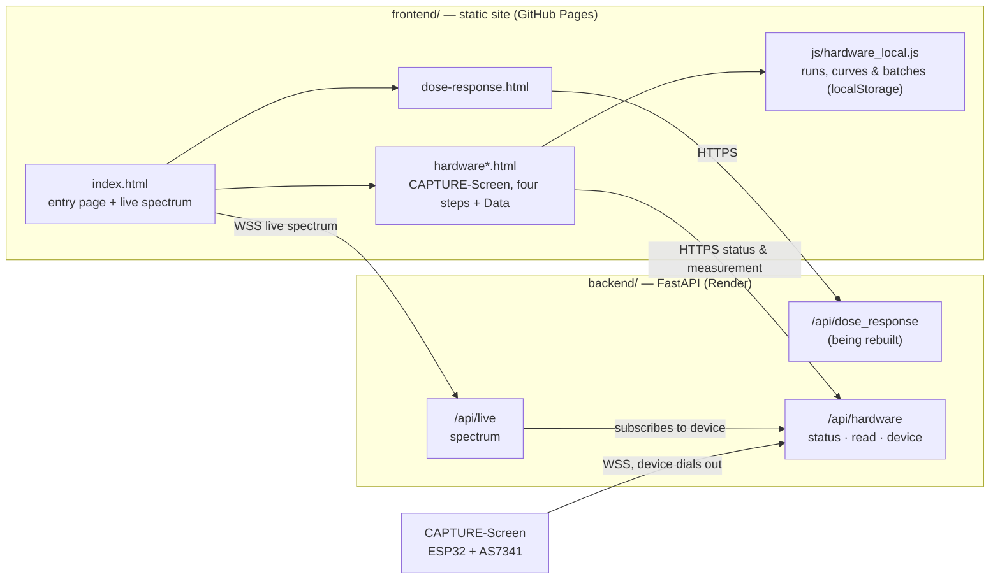

# LasReader

**Wet-lab data tools of iGEM NCKU-Tainan 2026 (Capture):** AHL dose-response analysis of plate-reader exports, and the software for CAPTURE-Screen, the team's own fluorescence reader.

| | |
|---|---|
| **Team** | [NCKU-Tainan, iGEM 2026](https://2026.igem.wiki/ncku-tainan/) — see the wiki's [Software](https://2026.igem.wiki/ncku-tainan/software) and [Hardware](https://2026.igem.wiki/ncku-tainan/hardware) pages |
| **Source code** | <https://gitlab.igem.org/2026/software-tools/ncku-tainan>, the team's official repository on iGEM's GitLab |
| **Live app** | <https://igem-ncku-software.github.io/igem-software/> (backend: <https://igem-ncku-software.onrender.com>). A convenience copy only: everything needed to install, run and evaluate LasReader is in this repository. |
| **License** | [MIT](LICENSE), an OSI-approved open-source license |
| **Status** | Active development for the iGEM 2026 Jamboree |

> **Research use only.** LasReader reports relative fluorescence and AHL concentrations *inferred* from a calibration curve. It is not intended for diagnostic use.

## Contents

- [Description](#description)
- [iGEM software requirements](#igem-software-requirements)
- [Architecture](#architecture)
- [Project structure](#project-structure)
- [Installation](#installation)
- [Usage](#usage)
- [Reproducing the main results](#reproducing-the-main-results)
- [Testing](#testing)
- [API](#api)
- [Data formats and integration](#data-formats-and-integration)
- [Dose-response analysis pipeline](#dose-response-analysis-pipeline)
- [Hardware: CAPTURE-Screen](#hardware-capture-screen)
- [Contributing and extending](#contributing-and-extending)
- [Dependencies](#dependencies)
- [Deployment](#deployment)
- [Roadmap and known limitations](#roadmap-and-known-limitations)
- [Authors and acknowledgment](#authors-and-acknowledgment)
- [License](#license)

## Description

Many synthetic-biology biosensors report a signal molecule, here the quorum-sensing molecule AHL, by expressing a fluorescent protein. Turning that fluorescence into a number you can trust takes more than reading a value: backgrounds must be subtracted, replicates combined, a dose-response curve fitted, and its limits respected. LasReader packages those steps into two web tools that any team can open in a browser, with nothing to install:

- **AHL dose-response analysis** of plate-reader data. *Being redesigned.* The previous analysis was removed on 2026-09-28 and is being rebuilt around the team's real SoftMax Pro (SpectraMax M3) data; it survives in git history.
- **CAPTURE-Screen interface.** CAPTURE-Screen is the team's low-cost fluorescence reader (ESP32 + AS7341 spectral sensor). Once the device powers on and joins Wi-Fi it connects to the backend by itself. The landing page then shows all ten spectral channels live, and four pages, used in order, guide you through:
  1. checking the instrument;
  2. calibrating it tube by tube with a weighted 4PL fit;
  3. reviewing the saved curves;
  4. measuring samples in replicate, with an inferred AHL concentration and a 95% CI for each.

Everything shown is a real reading. There is no simulated device or demo data anywhere.

### Who it is for

- **Wet-lab members of iGEM teams and other labs** who characterize a fluorescent biosensor, especially one that responds to AHL. The web pages need no programming: upload a file, or follow the numbered steps at the instrument.
- **Teams building a low-cost fluorescence reader.** CAPTURE-Screen's firmware, its data model ([docs/capture_screen_model.md](docs/capture_screen_model.md)) and its calibration workflow can be reused with any AS7341-based device.
- **Developers extending the tools.** Each analysis step is a separate, tested module, and the backend exposes a documented REST API.

The frontend is a plain static site (GitHub Pages) and the backend is FastAPI (Render). The two talk over HTTP/CORS and WebSocket, with no shared build step, so either half can be reused on its own.

## iGEM software requirements

How this repository meets the requirements the *iGEM 2026 Judge Handbook* sets for software (Chapter 4, Software):

| Requirement | Where it is met |
|---|---|
| Hosted on iGEM's GitLab | This repository, <https://gitlab.igem.org/2026/software-tools/ncku-tainan> |
| README explaining what the software does, who it is for, how to install and run it, and how to reproduce the main results | [Description](#description), [Who it is for](#who-it-is-for), [Installation](#installation), [Usage](#usage), [Reproducing the main results](#reproducing-the-main-results) |
| LICENSE file with an OSI-approved license | [LICENSE](LICENSE), MIT |
| Reproducible build and run instructions | [`scripts/`](scripts/) (`setup` + `dev`, in `.sh` and `.ps1`), plus the manual command sequence under [Installation](#installation). There are no compiled binaries: the frontend is served as source, and the firmware is built from source. |
| Pinned dependencies | [`backend/requirements.txt`](backend/requirements.txt) pins every package, direct and transitive, to the version the tests passed with. Chart.js is pinned to 4.4.1, and the firmware's library versions are listed under [Flashing the firmware](#flashing-the-firmware). |
| Repository under 50 MB | About 1 MB of source, tests and small images |

## Architecture


```mermaid
flowchart LR
    DEV["CAPTURE-Screen<br/>ESP32 + AS7341"]

    subgraph FE["frontend/ — static site (GitHub Pages)"]
        IDX["index.html<br/>entry page + live spectrum"]
        DR["dose-response.html"]
        HW["hardware*.html<br/>CAPTURE-Screen, four steps + Data"]
        LOCAL["js/hardware_local.js<br/>runs, curves & batches (localStorage)"]
        IDX --> DR
        IDX --> HW
        HW --> LOCAL
    end

    subgraph BE["backend/ — FastAPI (Render)"]
        RT1["/api/dose_response<br/>(being rebuilt)"]
        HUB["/api/hardware<br/>status · read · device"]
        LIVE["/api/live<br/>spectrum"]
        LIVE -->|subscribes to device| HUB
    end

    DR -->|HTTPS| RT1
    IDX -->|WSS live spectrum| LIVE
    HW -->|HTTPS status & measurement| HUB
    DEV -->|WSS, device dials out| HUB
```

## Project structure

```
frontend/                     plain static site, no framework, no build step
├── index.html                entry page: feature cards + live AS7341 spectrum
├── dose-response.html        dose-response analysis page (being redesigned)
├── hardware.html             CAPTURE-Screen step 1: the instrument and its self-check
├── hardware-calibration.html CAPTURE-Screen step 2: set up a run, read the standards, fit, save a curve
├── hardware-curves.html      CAPTURE-Screen step 3: saved curves and what each is valid for
├── hardware-measure.html     CAPTURE-Screen step 4: read samples in replicate through one curve
├── hardware-data.html        CAPTURE-Screen: backup, restore, reset
├── config/unmix_basis.json   which sensor channel is the fluorescence signal (placeholder until measured)
├── css/style.css
└── js/                       config / dose_response / backend_status / device_live
                              hardware_processing → hardware_local → hardware_api → hardware_common → each page's script

backend/                      FastAPI
├── app/
│   ├── main.py               mounts each feature's router
│   ├── config.py             environment variables and CORS settings
│   ├── hardware/             CAPTURE-Screen's relay: device connection, status, measurement
│   ├── live/                 live sensing: the shared Live switch and the live spectrum
│   └── dose_response/        dose-response analysis (being rebuilt; empty router)
├── tests/                    pytest
└── requirements.txt

docs/capture_screen_model.md  CAPTURE-Screen data model: from a raw reading to an inferred AHL concentration
firmware/capture_screen/      CAPTURE-Screen firmware (ESP32 + AS7341 + OLED + Live button), one sketch plus secrets.h
scripts/                      install and run scripts (.sh and .ps1 versions)
```

## Installation

To *use* LasReader you need nothing but a browser: open the [live app](https://igem-ncku-software.github.io/igem-software/). The steps below are for running it locally or developing it.

**Requirements:** Python 3.14 (the pinned dependencies were tested with 3.14.3) and Git. The frontend has no dependencies and doesn't need Node.js. Flashing the device additionally needs the Arduino IDE (see [Flashing the firmware](#flashing-the-firmware)).

```bash
git clone https://gitlab.igem.org/2026/software-tools/ncku-tainan.git
cd ncku-tainan
```

### Using the scripts (recommended)

Run these from the repository root: `setup` once, then `dev` every time after that.

```bash
# macOS / Linux / Windows Git Bash
bash scripts/setup.sh
bash scripts/dev.sh
```

```powershell
# Windows PowerShell
powershell -ExecutionPolicy Bypass -File scripts\setup.ps1
powershell -ExecutionPolicy Bypass -File scripts\dev.ps1
```

`dev` starts the backend at http://127.0.0.1:8000 (interactive API docs at `/docs`) and the frontend at http://127.0.0.1:5500 together. Ctrl+C shuts both down.

### Manual steps

If you'd rather not use the scripts, or only want to run one side:

```bash
# Backend
cd backend
python -m venv .venv
.venv\Scripts\activate          # Windows; on macOS/Linux use: source .venv/bin/activate
pip install -r requirements.txt
uvicorn app.main:app --reload

# Frontend (in another terminal)
cd frontend
python -m http.server 5500
```

> `main.py` lives inside the `app` package, so it can **only** be started with `uvicorn app.main:app`. Running `python main.py` or `uvicorn main:app` will fail.

Keep the frontend on port 5500 if you can, since the backend's CORS allowlist already includes it (see `backend/app/config.py`, or override it in `backend/.env`).

The frontend picks its backend from its own URL:
- `localhost` / `127.0.0.1` uses the local `http://127.0.0.1:8000`;
- everything else uses the Render backend.

That check lives in one place, [`frontend/js/config.js`](frontend/js/config.js).

## Usage

### Dose-response analysis

*Being redesigned.* The previous analysis was removed on 2026-09-28 and is being rebuilt around the team's real SoftMax Pro (SpectraMax M3) data; it survives in git history.

### CAPTURE-Screen

The hardware pages are one workflow, used in order. A step bar at the top of every page shows each step's state and which one comes next.

1. **Instrument.** Check that the backend, device, sensor and LED are all connected. Then run the self-check with a buffer-only cuvette, which checks dark stability and saturation.
2. **Calibrate.** Enter the biosensor strain and the standard concentrations. Then read each standard and blank in the order shown, or enter values recorded earlier. Fit the 4PL (you may exclude a tube, with a reason) and save the curve.
3. **Curves.** Review each saved curve: its fit, LOD/LOQ, usable range, and whether it matches the instrument's current configuration.
4. **Measure.** Choose a curve, read the blanks, then read each sample in replicate tubes. Each sample gets an inferred AHL concentration with a 95% CI, or "below LOD" / "above range". Finish the batch and export it as CSV.
5. **Data** (not a step). Export or restore one backup file holding all runs, curves and batches, or delete everything.

Runs, curves and batches are stored in your browser. **Export a backup from the Data page regularly**: clearing the browser's site data deletes them.

## Reproducing the main results

LasReader's main result is a CAPTURE-Screen calibration curve and the AHL inferred through it; it comes from the code in this repository, run locally as described under [Installation](#installation). The dose-response analysis is being redesigned, and its reproduction steps will return with it.

- **With the instrument:** follow [Usage → CAPTURE-Screen](#capture-screen) steps 1–4.
- **Without the instrument:** open Calibrate, choose *Enter recorded data*, and type in previously recorded readings (standards and blanks, in basic counts) together with the instrument configuration they were read under. Fitting, LOD/LOQ and saving work exactly as they do for a device run, so a published curve can be refitted from its recorded values.

A saved run or batch exports as CSV at full precision, and the Data page's backup holds everything needed to restore it on another computer. Every formula is in [docs/capture_screen_model.md](docs/capture_screen_model.md).

## Testing

```bash
cd backend
pytest
```

The suite covers the hardware relay and live spectrum (`tests/hardware/`, `tests/live/`, driven through a fake device connection). `tests/dose_response/` is empty until the analysis is rebuilt. `tests/conftest.py` adds `backend/` to `sys.path`, so run `pytest` from inside `backend/`.

The firmware compiles from the command line (warnings come only from inside the libraries):

```bash
arduino-cli compile --fqbn esp32:esp32:esp32doit-devkit-v1 firmware/capture_screen
```

## API

Backend URL: `https://igem-ncku-software.onrender.com`

| Method | Path | Description |
|---|---|---|
| `GET` | `/health` | Health check. The frontend footer's connection indicator polls it. |
| `GET` | `/api/hardware/status` | Whether CAPTURE-Screen is online, with its last reported status and config |
| `POST` | `/api/hardware/read` | Ask the device for one measurement (dark → light → dark) and return the raw reading |
| `WS` | `/api/hardware/device` | The device's own inbound connection |
| `WS` | `/api/live/spectrum` | The Live switch and the live spectrum, for browsers |

The full request/response schema can be explored interactively at `/docs` once the backend is running.

`/api/dose_response` is mounted but has no endpoints while the analysis is rebuilt.

## Data formats and integration

LasReader reads and writes open, documented formats, so its results can move into other tools:

| Direction | Format | Where |
|---|---|---|
| In | Recorded CAPTURE-Screen readings, typed in | Calibrate → *Enter recorded data* |
| Out | JSON for every API response, described by an OpenAPI schema | `/docs` (interactive) and `/openapi.json` on the backend |
| Out | CSV (UTF-8 with BOM, opens directly in Excel), one row per tube at full precision | One calibration run, or one measurement batch |
| In / Out | JSON backup of all runs, curves and batches (format `lasreader.hardware.backup`, version 2) | Data page |

Other software can call the REST API directly, for example a notebook reading `/api/hardware/status`.

## Dose-response analysis pipeline

*Being redesigned.* The previous analysis was removed on 2026-09-28 and is being rebuilt around the team's real SoftMax Pro (SpectraMax M3) data; it survives in git history. Its dependencies (numpy, scipy, pandas, lmfit, PyYAML, python-multipart) stay in `requirements.txt` for the rebuild.

## Hardware: CAPTURE-Screen

CAPTURE-Screen is the team's own fluorescence reader: an ESP32 plus an AS7341 spectral sensor, reading sfGFP fluorescence. When the device is off, the pages say it is offline; they never fall back to simulated data.

**The data model** is documented step by step in [docs/capture_screen_model.md](docs/capture_screen_model.md): dark subtraction, normalization, the weighted 4PL fit, LOD/LOQ, and inversion with a 95% CI.

### How the device connects to the software

The backend runs on Render and can't reach a device behind a lab or home router, so the direction is reversed. Once the device powers on and joins Wi-Fi, it dials out to `wss://igem-ncku-software.onrender.com/api/hardware/device` and keeps that connection open, reconnecting by itself if it drops. Web pages only ever talk to the backend, which relays over that connection:

- **Live spectrum** (landing page, device OLED).
  - Live is one switch, owned by the device and shared by its button (GPIO 13) and the Live switch on every open landing page.
  - Flipping either one turns the LED on and streams about two frames per second to every page and to the OLED's bar chart. The device reports the new state straight away, so every switch shows the same thing.
  - Live switches itself off after 10 minutes, since leaving the LED on heats and bleaches the sample; the page shows when.
  - It can't be switched on during a measurement or while the sensor isn't answering.
- **Measurement** (instrument check, calibration, Measure).
  - The page sends `POST /api/hardware/read`, and the device runs one dark → light → dark cycle (about 3 s). The backend hands the raw reading back to the page.
  - Dark subtraction, normalization and unmixing all happen in the browser (`js/hardware_processing.js`).
  - Live streaming pauses during a measurement and resumes by itself afterwards.

### Flashing the firmware

1. Install ESP32 board support in the Arduino IDE, plus the libraries DFRobot_AS7341, Adafruit SSD1306, Adafruit GFX, ArduinoJson (7.x) and WebSockets (Markus Sattler). The sketch is verified to compile against ESP32 core 3.3.8, DFRobot_AS7341 1.0.0, Adafruit SSD1306 2.5.17, Adafruit GFX 1.12.6, ArduinoJson 7.4.3 and WebSockets 2.7.2.
2. Copy `firmware/capture_screen/secrets.h.example` to `secrets.h` in the same folder, and fill in your Wi-Fi name and password (the ESP32 supports 2.4 GHz only). `secrets.h` is excluded by `.gitignore`, so the password is never committed. The sketch refuses to compile without it.
3. Open `firmware/capture_screen/capture_screen.ino`, select the ESP32 Dev Module board, and flash it.
4. When the OLED status bar shows `Web ok`, the device is connected, and the landing page's Live card shows `CAPTURE-Screen online`. If it won't connect, open the Serial Monitor (115200). Lines starting with `[wifi]` and `[backend]` show where it is stuck.

Without a network the button still switches Live, and the OLED shows the spectrum; measurements always come from a web page. The Serial Monitor offers diagnostics only (`?` settings, `i` I2C scan, `b` button, `l` LED, `d` dark/light table, `g`/`t`/`s` sensor settings).

The Render free tier sleeps after a period of inactivity and can take tens of seconds to wake up. The device keeps retrying during that time, so there is no need to reflash or restart it.

### Connecting the device during local development

The backend must be reachable from the device on the local network:

1. From `backend/`, run `uvicorn app.main:app --host 0.0.0.0 --port 8000`.
2. In `secrets.h`, uncomment:
   - `BACKEND_HOST`, filled in with this computer's LAN IP;
   - `BACKEND_PORT 8000`;
   - `BACKEND_USE_TLS 0`.
3. Reflash the device.

### Pages

Each page has numbered step cards in addition to the step bar. A step that can't start yet says what it is waiting for.

| Step | Page | Purpose |
|---|---|---|
| 1 Instrument | `hardware.html` | Connection and self-check status, naming the link that failed (backend → device → sensor / LED). The full configuration. A buffer-only self-check of dark stability and saturation, with informational dark-level and light − dark readings. |
| 2 Calibrate | `hardware-calibration.html` | Set up a run with its biosensor strain. Read the standards tube by tube, or enter recorded data. Fit the 4PL, excluding tubes only with a reason, and save the curve. |
| 3 Curves | `hardware-curves.html` | Every saved curve, what it is valid for, and whether it matches the instrument now |
| 4 Measure | `hardware-measure.html` | A batch: choose a curve, read the blanks, read each sample in replicate tubes. Each sample gets an inferred AHL with a 95% CI; the batch exports as CSV. |
| — | `hardware-data.html` | One backup file for runs, curves and batches; restore; delete everything |

The Instrument self-check is not saved, and it does not replace calibration or a measurement blank. A pass covers only dark stability and saturation under the checked configuration; LED response is not verified.

The frontend is layered so that once a storage backend exists, only the API layer needs to change:

- `js/hardware_processing.js`: pure functions that turn a raw device reading into a `Measurement` (dark subtraction, normalization, saturation check, unmixing, QC flags, config fingerprint).
- `js/hardware_local.js`: temporary browser storage for calibration runs, curves and measurement batches; weighted 4PL fitting, LOD/LOQ, and inversion with a 95% CI.
- `js/hardware_api.js`: the one interface every hardware page calls. Anything device-related goes through the backend; everything else goes through `hardware_local.js`. It also defines the data contract via JSDoc (`Measurement`, `CalibrationPlan`, `CalibrationCurve`, `MeasurementBatch`, `InverseEstimate`, etc.).
- `js/device_live.js`: the landing page's live spectrum, a ten-channel bar chart of the latest frame. Display only; it never stores a frame.

Two rules that must never be broken:
- **No numeric concentration is ever shown** unless the inversion result is `ok`; the software never extrapolates outside a curve's range.
- **The pages must never contain diagnostic claims, pathogen-detection wording, or a claim to quantify AHL.** The only exception is the required research-use-only footer line.

### Backend configuration

`backend/.env` (copy it from `.env.example`):

```dotenv
# How long without a message from the device before it's considered offline (firmware reports every 5 s)
HARDWARE_ONLINE_TIMEOUT_SECONDS=15
# Upper bound on waiting for one measurement result (a measurement itself takes about 3 s)
HARDWARE_READ_TIMEOUT_SECONDS=10
```

## Contributing and extending

Future iGEM teams are welcome to reuse, fork and extend LasReader. Please open an issue or a merge request on the repository.

**Adding a backend feature.**
1. Create a folder under `backend/app/` containing its own `router.py`, which defines an `APIRouter` with its own path prefix. Put the computation in other modules alongside it.
2. Add one `include_router()` line in `app/main.py`. There's no shared base class or plugin registry; each feature is wired in by hand. Please don't add routes directly to `main.py`.
3. Add tests under `backend/tests/`.

**Adding a frontend page.**
1. Add an `.html` file under `frontend/`.
2. Load `js/config.js` first (it defines `BACKEND_BASE_URL`), then that page's own script.
3. Link the page from `index.html`.

Each script handles only its own page. The exception is CAPTURE-Screen's hardware pages, which share `hardware_api.js` and `hardware_common.js`. No deployment change is needed: GitHub Actions uploads the whole `frontend/` folder as-is.

**Changing the CAPTURE-Screen model.** When a formula, threshold or rule in `hardware_processing.js` or `hardware_local.js` changes, update the matching section of [docs/capture_screen_model.md](docs/capture_screen_model.md) in the same change.

## Dependencies

**Backend** (`backend/requirements.txt`, every version pinned):
- FastAPI and uvicorn, plus websockets (uvicorn needs it to serve WebSockets);
- pydantic, python-multipart, python-dotenv, pyyaml;
- numpy, scipy, pandas, lmfit;
- pytest and httpx, for testing;
- the packages these pull in, pinned too.

**Firmware** (Arduino Library Manager): DFRobot_AS7341, Adafruit SSD1306, Adafruit GFX, ArduinoJson 7, WebSockets (Markus Sattler).

**Frontend**: only [Chart.js](https://www.chartjs.org/) 4.4.1, loaded via `<script>` from cdnjs. It isn't vendored into the repository, and there is no npm toolchain.

## Deployment

- **Frontend.** Pushing to `main` makes [`.github/workflows/deploy-pages.yml`](.github/workflows/deploy-pages.yml) upload the whole `frontend/` folder as-is to GitHub Pages. There is no build or transform step, so new files are picked up automatically.
- **Backend.** Deployed on Render, configured outside this repository. To let a new frontend origin call the backend, add it to `CORS_ORIGINS` (see the defaults in [`backend/app/config.py`](backend/app/config.py), or override it with an environment variable).

## Roadmap and known limitations

- **No authentication on the device link.** Anyone who knows the URL could impersonate the device or trigger a measurement. A shared secret between the device and the backend is planned.
- **Browser-only storage.** Runs, curves and batches live in the browser's localStorage, so use the Data page's backup. They are planned to move to a backend database; only `hardware_api.js` would change.
- **Placeholder unmixing.** The fluorescence signal is the F4 channel alone until an sfGFP standard's spectrum has been measured on the instrument ([model §3.3](docs/capture_screen_model.md#33-unmixing-choosing-the-signal)).
- **Dose-response analysis being rebuilt.** The page and `/api/dose_response` are empty until the new analysis lands.
- **One backend process.** The device relay keeps its state in memory, which suits Render's single free instance. A multi-worker deployment would need a pub/sub layer.

## Authors and acknowledgment

LasReader was developed by the software group of **iGEM NCKU-Tainan 2026** (National Cheng Kung University, Tainan, Taiwan). Team members and their contributions are listed on the team wiki's [Team](https://2026.igem.wiki/ncku-tainan/team) and [Attributions](https://2026.igem.wiki/ncku-tainan/attributions) pages.

We thank the authors of the open-source libraries listed under [Dependencies](#dependencies).

## License

LasReader is released under the [MIT License](LICENSE), an OSI-approved open-source license, as required by iGEM for software tools. You may use, modify and redistribute it, including in future iGEM projects, provided the copyright notice and license text are kept.

Third-party components keep their own licenses and are not redistributed in this repository: Chart.js (MIT) is loaded from a CDN, and the Python and Arduino libraries are installed by their package managers.
