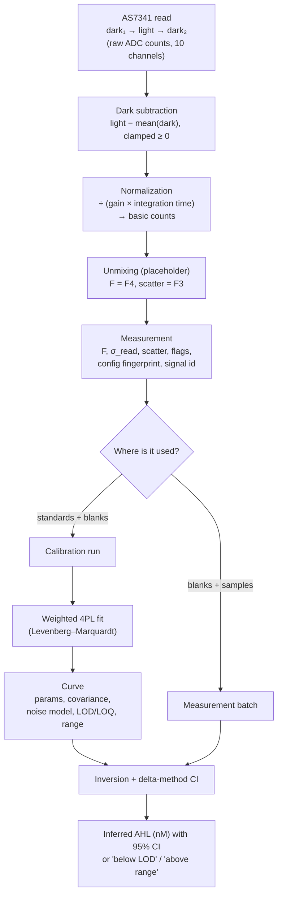

# CAPTURE-Screen data model

How a CAPTURE-Screen reading becomes an inferred AHL concentration: every processing step, its equation, and why it is done that way.

This document describes the code as it is. The code in `frontend/js/hardware_processing.js`, `frontend/js/curve_fit.js` and `frontend/js/hardware_local.js` is the reference implementation. If the two ever disagree, the code is what runs, and this document should be corrected.

> **Scope.** CAPTURE-Screen is a research-use-only instrument. The output of this model is an *inferred* AHL concentration relative to a calibration curve made with the same biosensor strain and instrument configuration. It is not a diagnostic result.

---

## Contents

1. [Overview](#1-overview)
2. [Acquisition: one read](#2-acquisition-one-read)
3. [From raw counts to a Measurement](#3-from-raw-counts-to-a-measurement)
4. [Quality flags](#4-quality-flags)
5. [Instrument configuration and the fingerprint](#5-instrument-configuration-and-the-fingerprint)
6. [Calibration run design](#6-calibration-run-design)
7. [The 4PL calibration model](#7-the-4pl-calibration-model)
8. [Noise model and weights](#8-noise-model-and-weights)
9. [Fitting: weighted Levenberg–Marquardt](#9-fitting-weighted-levenbergmarquardt)
10. [LOD, LOQ and the usable range](#10-lod-loq-and-the-usable-range)
11. [Inversion: signal → concentration with a 95% CI](#11-inversion-signal--concentration-with-a-95-ci)
12. [Measurement batches: replicates and blanks](#12-measurement-batches-replicates-and-blanks)
13. [When a curve may be used](#13-when-a-curve-may-be-used)
14. [Instrument self-check](#14-instrument-self-check)
15. [Assumptions and known limitations](#15-assumptions-and-known-limitations)
16. [Code map](#16-code-map)

---

## 1. Overview



The model has three layers:

| Layer | What it does | Where |
|---|---|---|
| **Signal processing** | Raw counts → one number per tube, the fluorescence *F* in basic counts, plus its read-noise SD and QC flags. No state and no fitting. | `hardware_processing.js` |
| **Calibration** | Standards of known AHL concentration → a four-parameter logistic (4PL) curve with its uncertainty, LOD, LOQ and usable range. | `curve_fit.js` (`CurveFit.fit`), called by `hardware_local.js` (`fitCurve`) |
| **Inversion** | A sample's *F* → an AHL concentration with a 95% confidence interval, only inside the curve's usable range. | `curve_fit.js` (`CurveFit.invert`) |

The calibration and inversion layers (§7–11) are shared with the Plate Reader Assay (`plate-assay.html`), which fits the same 4PL to plate-reader standards and infers AHL in the samples on the same plate. There the signal is whatever the reader reports, each reading carries no read-noise SD, and the curve is used only for the readings entered with it.

---

## 2. Acquisition: one read

Every stored measurement comes from one `POST /api/hardware/read`. The firmware answers it with three consecutive frames, and each frame is all ten AS7341 channels (F1–F8, Clear, NIR) as integer ADC counts:

| Frame | LED | Settle before reading |
|---|---|---|
| `dark_1` | off | 50 ms (`DARK_SETTLE_MS`); 100 ms (`TX_QUIET_MS`) on the 3D-printed build |
| `light` | on | 100 ms (`LIGHT_SETTLE_MS`) |
| `dark_2` | off | 50 ms |

The LED is on only during the `light` frame. This limits heating and photobleaching of the sample. The dark frames on either side measure everything that is not LED-excited fluorescence: ambient light leaking into the chamber, sensor offset, and the drift between the two dark frames.

CAPTURE-Screen has two builds, each with its own firmware and the same protocol: the laser-cut build ([`capture_screen.ino`](../firmware/capture_screen/capture_screen.ino)) and the 3D-printed build ([`capture_screen_3d.ino`](../firmware/capture_screen_3d/capture_screen_3d.ino)). On the 3D-printed build nothing is sent during a read, and the first dark read waits `TX_QUIET_MS` after the last message, to keep the firmware's own Wi-Fi traffic out of the readings. The sensor settings at boot are:

| Setting | Laser-cut build | 3D-printed build | Consequence |
|---|---|---|---|
| Gain | 512× (register code 10) | 512× (register code 10) | |
| ATIME, ASTEP | 59, 999 | 255, 280 | Integration time (ATIME+1)(ASTEP+1) × 2.78 µs ≈ **166.8 ms** / **200.0 ms**; full scale min(65535, (ATIME+1)(ASTEP+1)) = **60 000** / **65 535 counts** |
| LED current | 5.553 mA | Not yet measured | Bench-measured; the firmware cannot read it back, so it is a constant. The 3D-printed build reports 0 and refuses every read until its value is entered. |
| Build ID | `P1-PROTO-01` | `3D-V2-01` | Part of the config fingerprint (§5), so a curve made on one build never converts the other's readings. |

Live-stream frames (`mode: "live"`) are never turned into Measurements. They have no dark frames, so they carry the ambient background, and `toMeasurement()` refuses any reading whose `mode` isn't `"measurement"`.

---

## 3. From raw counts to a Measurement

`HardwareProcessing.toMeasurement()` applies the steps below in order. All of them are pure functions, and the same code is intended to be ported unchanged to the backend.

### 3.1 Dark subtraction

For each channel *k*:

$$
S_k = \max\!\left(0,\; L_k - \bar D_k\right), \qquad \bar D_k = \tfrac{1}{n_d}\sum_{j=1}^{n_d} D_{j,k}
$$

where *L* is the light frame and $D_1, D_2$ are the dark frames ($n_d$ = 2 normally). Averaging the two darks cancels any drift that is linear in time, since the light frame sits between them.

- The clamp at 0 is there because a negative fluorescence has no physical meaning. A blank whose light frame falls slightly below its dark reads as 0, not as a negative number.
- If only one dark frame arrived, that one is used. If neither arrived, nothing is subtracted, and the reading is flagged `NO_DARK_PAIR` (§4).

### 3.2 Normalization to basic counts

Raw counts depend on the sensor's gain and integration time. The code divides them out so that readings taken with different settings are on the same scale:

$$
B_k = \frac{S_k}{g \cdot t_\text{int}}, \qquad t_\text{int}\,[\text{ms}] = (\text{ATIME}+1)(\text{ASTEP}+1)\times 2.78\times10^{-3}
$$

The unit of $B_k$ is **basic counts**. With the default settings the divisor is 512 × 166.8 ≈ 85 400, so a real sample's F4 is often well below 1 basic count. For example, on the instrument's first self-check (2026-09-27), a light − dark of +271 raw counts is 271 / 85 400 ≈ 0.0032 basic counts. This is why the pages show fluorescence to four significant figures rather than a fixed number of decimals.

Normalization does **not** make readings under different settings interchangeable for calibration. The AS7341's response is not perfectly linear in gain, and the LED current is not part of the normalization at all. A curve is therefore still bound to the exact configuration it was made with (§5, §13).

### 3.3 Unmixing: choosing the signal

`config/unmix_basis.json` defines which number is "the fluorescence". The only method implemented today is:

```json
{ "version": "placeholder-0", "method": "single_channel", "signal_channel": "F4", "scatter_channel": "F3" }
```

$$
F = B_{\text{F4}}, \qquad \text{scatter} = B_{\text{F3}}
$$

F4 (~515 nm) is the channel closest to sfGFP's emission peak. F3 (~480 nm) sits near the excitation band, so it is mostly excitation light scattered by cells and debris, which makes it a turbidity proxy.

This is a **placeholder**. A proper linear unmixing (least squares against a measured sfGFP emission spectrum and a scatter spectrum) needs a spectrum measured from an sfGFP standard on this instrument. No basis values have been invented in the meantime. While the basis `version` begins with `placeholder`, every page that shows fluorescence says so.

Every Measurement, run and curve records a **signal id** (`signalId(basis)`, currently `"F4"`). A curve only converts readings with the same signal id. If the signal definition changes later (a ratio, an OD correction, a measured unmixing), old curves keep saying what they were fitted on, and they can't silently convert a different kind of number.

### 3.4 Read-noise estimate

Each Measurement carries `fluorescence_sd`, an estimate of its **read noise** only.

The two dark frames are two independent readings of the same background, so their difference estimates the noise of a single frame:

$$
\sigma_\text{frame} = \max\!\left(\frac{|D_2 - D_1|}{\sqrt 2},\; \frac{1}{\sqrt{12}}\right)
$$

The floor $1/\sqrt{12} \approx 0.29$ counts is the standard deviation of ADC quantization (a uniform error over one count), so the estimate is never zero.

The fluorescence is $L - \bar D$, so its variance is one frame's variance plus the variance of the mean of the dark frames:

$$
\sigma_S = \sigma_\text{frame}\sqrt{1 + 1/n_d}, \qquad \texttt{fluorescence\_sd} = \frac{\sigma_S}{g\,t_\text{int}}
$$

With no dark frames the code uses $\sigma_\text{frame}$ alone.

This estimate does not include **shot noise**, which grows with the signal. A single read gives no information that could estimate it. §8 explains how the fit makes up for this with a noise model estimated from replicate tubes.

### 3.5 The Measurement

The result, as defined by the `Measurement` typedef in `hardware_api.js`, is:

| Field | Meaning |
|---|---|
| `fluorescence` | *F*, basic counts |
| `fluorescence_sd` | read-noise SD, basic counts (`null` for manually entered values) |
| `scatter` | F3, basic counts (`null` for manual entries) |
| `raw` | all ten channels after dark subtraction and normalization |
| `signal` | signal id, e.g. `"F4"` |
| `config_fingerprint` | the instrument configuration it was read under (§5) |
| `flags` | QC flags (§4) |
| `sample_type`, `known_concentration_nM` | blank / standard / unknown, and the standard's concentration |
| `source` | `"device"` or `"manual"` |

---

## 4. Quality flags

| Flag | Set when | Effect |
|---|---|---|
| `SATURATED` | Any channel's **raw** light count ≥ full scale, $\min(65535, (\text{ATIME}+1)(\text{ASTEP}+1))$ | The number underestimates the true signal. Shown on the tube. A saturated blank never becomes the scatter baseline. |
| `NO_DARK_PAIR` | `dark_1` or `dark_2` is missing | Dark subtraction and read noise are less reliable. Shown on the tube. |
| `HIGH_SCATTER` | scatter > 2 × the scatter of the most recent clean blank read under the same configuration | The tube is much more turbid than the blank, so part of F4 may be scattered excitation light rather than fluorescence. |
| `STALE_CONFIG` | The tube was read under a different configuration (or signal) than its run or batch | In a run the fit refuses it until it is re-read or excluded. In a batch it is excluded automatically and can't be included again. |

**The scatter baseline.** `HIGH_SCATTER` compares against "the last blank read". That blank must be a **cell blank**: cells at the standards' OD with no AHL. That is why the baseline is updated only by run blanks and batch blanks that carry none of the three flags above, and why the Instrument self-check (a buffer-only cuvette) deliberately never touches it. A buffer blank would set the baseline far below any real sample and flag every tube read after it. The baseline is kept per configuration fingerprint, and it is not included in backups because it is derived state that the next blank re-establishes.

Flags do not remove a tube from any calculation by themselves. The user decides whether to exclude a flagged tube, and must give a reason (§9.4, §12).

---

## 5. Instrument configuration and the fingerprint

A calibration curve is only valid for readings taken the same way. The **configuration** is every setting that changes what a reading means:

| Field | Why it matters |
|---|---|
| `led_current_mA` | Excitation intensity. Fluorescence scales with it. |
| `gain` | The sensor's analogue gain |
| `atime`, `astep` | Integration time and full scale |
| `build_id` | The firmware build. It is changed deliberately whenever the reading path changes, so that all existing curves become stale on purpose. |

The fingerprint condenses these into six hex digits:

```
canonical   = LED current to 3 decimals | gain | atime | astep | build_id     (joined with "|")
fingerprint = first 6 hex digits of FNV-1a-32( UTF-8(canonical) )
```

With the laser-cut build's default settings the canonical string is `5.553|512|59|999|P1-PROTO-01`. The order and formatting are fixed: the firmware sends `led_current_mA` as a 3-decimal string, and a future backend must reproduce the same string exactly. The emission filter is part of the `HardwareConfig` contract but is not in the fingerprint yet, because the firmware doesn't know which filter is installed.

---

## 6. Calibration run design

A calibration run is a list of tubes read one at a time through a single cuvette. It needs:

- **≥ 4 distinct positive concentrations**, since a 4PL has four parameters;
- **1–10 replicates** per concentration;
- **2–10 blanks** (no AHL). At least 2 are required because the LOD needs a blank SD.

**Reading order.** The tubes are interleaved in *replicate rounds*. Each round is one blank followed by every concentration from low to high:

```
round 1: blank r1, 1 nM r1, 10 nM r1, 100 nM r1, 1 µM r1
round 2: blank r2, 1 nM r2, 10 nM r2, 100 nM r2, 1 µM r2
round 3:           1 nM r3, 10 nM r3, 100 nM r3, 1 µM r3     (3 replicates, 2 blanks)
```

There are two reasons for this order:

- **Drift is spread out.** Instrument drift (temperature, LED ageing during a session) falls on every concentration equally, instead of making, say, all the high standards read late and high.
- **Carryover is limited.** Within a round the one cuvette always moves from low to high concentration, so residue from the previous tube adds relatively little.

The run can only be read in this order: the software accepts only the next unread slot, or a re-read of one already read.

A run is bound to the instrument's configuration fingerprint and the current signal id at the moment it is created. It also records the **conditions**: the biosensor strain, plus free-text notes.

**Manual datasets.** Values recorded earlier can be typed in instead of read. They are stored as a run with every slot already filled and `source: "manual"`, and are fitted exactly like a device run. They have no read-noise SD and no scatter, so those fields are `null`; §8 and §9 explain how the fit handles this.

---

## 7. The 4PL calibration model

The biosensor's fluorescence response to AHL is sigmoidal on a log-concentration axis. It is modelled with the **four-parameter logistic** (4PL, also known as the Hill equation with baseline):

$$
F(c) = B + \frac{T - B}{1 + \left(\dfrac{\mathrm{EC_{50}}}{c}\right)^{h}}, \qquad F(0) = B
$$

| Parameter | Meaning |
|---|---|
| $B$ (`bottom`) | Signal with no AHL (the uninduced baseline, including leaky expression) |
| $T$ (`top`) | Saturated signal at high AHL |
| $\mathrm{EC_{50}}$ (`ec50_nM`) | Concentration giving half the response, $(T+B)/2$ |
| $h$ (`hill`) | Steepness (the Hill coefficient) |

Blanks enter the fit as points at $c = 0$, where the model equals $B$. This lets the blanks pin down the baseline directly.

**Parameterization.** Internally the fit uses

$$
\theta = \left(T,\; B,\; \ln \mathrm{EC_{50}},\; h\right)
$$

Fitting $\ln \mathrm{EC_{50}}$ instead of $\mathrm{EC_{50}}$ has two effects. The optimizer steps on a log scale, which matches how the standards are spaced. And $\mathrm{EC_{50}} = e^{\ln \mathrm{EC_{50}}}$ can never become negative. The model is written in a numerically stable form:

$$
u = e^{\,h(\ln \mathrm{EC_{50}} - \ln c)}, \qquad s = \frac{1}{1+u}, \qquad F = B + (T-B)\,s
$$

The derivatives used by the fit (the Jacobian row for one point) are:

$$
\frac{\partial F}{\partial T} = s,\quad
\frac{\partial F}{\partial B} = 1-s,\quad
\frac{\partial F}{\partial \ln\mathrm{EC_{50}}} = -(T-B)\,s(1-s)\,h,\quad
\frac{\partial F}{\partial h} = -(T-B)\,s(1-s)\,(\ln\mathrm{EC_{50}} - \ln c)
$$

The code computes $s(1-s)$ rather than $u/(1+u)^2$ because it stays finite when $u$ overflows.

A fitted curve is accepted only if $T > B$, which means an increasing response. A strain that doesn't respond gives no curve, rather than a fitted line through noise.

---

## 8. Noise model and weights

Replicate readings are noisier at high signal than at low signal, so an unweighted fit would let the high standards dominate. The fit is therefore weighted, and the weights come from a two-component **variance model**:

$$
\operatorname{Var}(F) = a + b\,F^2
$$

- $a$ is additive noise (read noise and background), constant across concentrations.
- $b\,F^2$ is proportional noise (pipetting, cell-density and expression variability, and shot noise to first order), which grows with the signal.

### 8.1 Estimating a and b from replicates

The code groups the included points by concentration, with the blanks as their own group at $c = 0$, and keeps only groups with ≥ 2 tubes. For each group it computes the mean $\bar F_g$ and the sample variance $s_g^2$. It then fits $a$ and $b$ by ordinary least squares, regressing $s_g^2$ on $\bar F_g^2$:

$$
s_g^2 \approx a + b\,\bar F_g^2
$$

A variance must not be negative, so:

- if $b < 0$ (or the regression is degenerate), the code sets $b = 0$ and $a = \text{mean}(s_g^2)$: purely additive noise;
- if $a < 0$, it sets $a = 0$ and fits $b$ through the origin: purely proportional noise.

If no concentration has replicates, $a$ is the mean of the tubes' own squared read-noise SDs and $b = 0$.

### 8.2 The weight of each tube

Each point *i* gets the standard deviation

$$
\sigma_i = \max\!\left(\texttt{fluorescence\_sd}_i,\; \sqrt{a + b\,y_i^2},\; 10^{-9}\max_j|y_j|\right)
$$

and the weight $w_i = 1/\sigma_i^2$. Taking the larger of the tube's own read noise and the replicate model matters because the device's read noise leaves out shot noise (§3.4). A tube with an unusually quiet dark pair would otherwise get an enormous weight it doesn't deserve. The tiny last term only prevents division by zero.

### 8.3 No noise information: the unweighted fallback

For a manual dataset with one tube per concentration, there is no read-noise SD and no replicate spread ($a = b = 0$ and every SD is 0). In that case the fit is **unweighted** ($\sigma_i = 1$). The reading variance used later for LOD and the inversion CI is then estimated from the fit's own residuals:

$$
a = \frac{\mathrm{RSS}}{N-4}, \qquad b = 0
$$

---

## 9. Fitting: weighted Levenberg–Marquardt

### 9.1 Objective

The fit minimizes the weighted sum of squares over the *N* included tubes:

$$
\chi^2(\theta) = \sum_{i=1}^{N} \left(\frac{y_i - F(c_i;\theta)}{\sigma_i}\right)^2
$$

### 9.2 Starting values

- $B_0$ = the mean of the lowest-concentration group (the blanks);
- $T_0$ = the mean of the highest-concentration group, nudged just above $B_0$ if it isn't above it;
- $\mathrm{EC_{50},}_0$ = the standard concentration whose mean is closest to $(T_0 + B_0)/2$;
- $h_0$ = 1.

### 9.3 Iteration

Each iteration solves the damped normal equations for a step $\delta$:

$$
\left(J^\top W J + \lambda\,\operatorname{diag}(J^\top W J)\right)\delta = J^\top W r
$$

where *J* is the N × 4 Jacobian (§7), $W = \operatorname{diag}(w_i)$, and $r_i = y_i - F(c_i)$. (A tiny $10^{-12}$ is also added to the diagonal to keep it solvable.)

- If a step lowers $\chi^2$, it is accepted and $\lambda$ is divided by 10, which moves the step towards Gauss–Newton.
- If not, $\lambda$ is multiplied by 10, which moves the step towards gradient descent, and the step is tried again.
- The Hill coefficient is constrained to $0.05 < h < 20$: any step outside that range is rejected.
- The fit stops when the relative improvement falls below $10^{-10}$, when no step can be accepted, or after 500 iterations.

### 9.4 Parameter covariance

At the optimum:

$$
\Sigma_\theta = \left(J^\top W J\right)^{-1} \cdot \frac{\chi^2_\text{min}}{N - 4}
$$

The scaling by the reduced $\chi^2$ is the standard correction for a noise model whose absolute scale may be off: if the weights overstate or understate the scatter, the covariance is rescaled to match the residuals. If $J^\top W J$ is singular, or any covariance entry isn't finite, the fit is reported as not converged and no curve is made.

The curve also stores

$$
\mathrm{RMSE} = \sqrt{\mathrm{RSS}/N}
$$

with unweighted residuals, in basic counts, as a plain goodness-of-fit number.

### 9.5 Exclusions

The user can exclude any tube before fitting, for example an obvious pipetting error or a flagged tube. An excluded tube:

- stays in the run, on the plot and in the CSV;
- is recorded on the saved curve with a **mandatory reason**.

The fit refuses to run if, after exclusions, fewer than 2 blanks or 4 concentrations remain, or if a tube read under another configuration is still included.

---

## 10. LOD, LOQ and the usable range

### 10.1 Limits in signal

The limits follow the usual blank-based definition: the blank level plus 3 (LOD) or 10 (LOQ) blank standard deviations.

$$
\bar y_\text{blank} = \max\!\left(\text{mean of blank tubes},\; B\right), \qquad s_\text{blank} = \text{sample SD of blank tubes}
$$

$$
F_\text{LOD} = \bar y_\text{blank} + 3\,s_\text{blank}, \qquad F_\text{LOQ} = \bar y_\text{blank} + 10\,s_\text{blank}
$$

The blank level is not allowed below the fitted bottom $B$, since the curve can't invert a signal below $B$. If the blanks happen to be identical ($s_\text{blank} = 0$), the code falls back to the residual noise (unweighted fits) or the blanks' mean $\sigma_i$.

If $F_\text{LOQ} \ge T$, the blank scatter is too large relative to the response to define limits, and no curve is made.

### 10.2 Limits in concentration

Each signal limit is converted through the inverse 4PL (§11):

$$
\mathrm{LOD_{nM}} = \mathrm{EC_{50}}\left(\frac{F_\text{LOD} - B}{T - F_\text{LOD}}\right)^{1/h}
$$

and the same for the LOQ.

### 10.3 Usable (inversion) range

The curve gives a number only inside

$$
c_\text{min} = \max\!\left(\mathrm{LOD_{nM}},\; \text{lowest standard}\right)
$$

$$
c_\text{max} = \min\!\left(\text{highest standard},\; \mathrm{EC_{50}}\cdot 19^{1/h}\right)
$$

- **The lower bound.** Below the LOD, a signal can't be told apart from the blank. Below the lowest standard, the curve's shape is only extrapolated.
- **The upper bound.** Above the highest standard, the curve is extrapolated. And at $\mathrm{EC_{50}}\cdot 19^{1/h}$, the curve has reached 95% of its span $(T - B)$. Beyond that point it is so flat that a tiny change in *F* maps to a huge change in *c*, and the inversion error blows up. (Here 19 = 0.95 / 0.05.)

If $c_\text{min} \ge c_\text{max}$, the curve has no usable range and is not made.

---

## 11. Inversion: signal → concentration with a 95% CI

### 11.1 Point estimate

Solving the 4PL for *c*:

$$
\ln c = \ln \mathrm{EC_{50}} + \frac{1}{h}\,\ln\!\frac{F - B}{T - F}
$$

The result is one of three statuses:

| Condition | Status | Reported concentration |
|---|---|---|
| $F \le B$, or $c < c_\text{min}$ | `below_lod` | none |
| $F \ge T$, or $c > c_\text{max}$ | `above_range` | none |
| otherwise | `ok` | *c* with its 95% CI |

The model **never extrapolates**. A number is only shown when the status is `ok`. (A value between the LOD and the lowest standard is also reported as `below_lod`, since both mean "below what this curve can quantify".)

### 11.2 Uncertainty: the delta method

The uncertainty is propagated on $\ln c$ rather than on *c*, because concentration errors are multiplicative and $\ln c$ is closer to normally distributed.

Two independent sources contribute:

- **the reading itself**, from the variance model $a + bF^2$ (§8), divided by the number of tubes *n* averaged into *F* (§12);
- **the curve**, from the parameter covariance $\Sigma_\theta$ (§9.4).

The gradients of $\ln c$ are:

$$
g_F = \frac{\partial \ln c}{\partial F} = \frac{1}{h}\left(\frac{1}{F-B} + \frac{1}{T-F}\right)
$$

$$
g_\theta = \left(\frac{\partial \ln c}{\partial T},\, \frac{\partial \ln c}{\partial B},\, \frac{\partial \ln c}{\partial \ln\mathrm{EC_{50}}},\, \frac{\partial \ln c}{\partial h}\right)
= \left(-\frac{1}{h(T-F)},\; -\frac{1}{h(F-B)},\; 1,\; -\frac{1}{h^2}\ln\frac{F-B}{T-F}\right)
$$

The variance of $\ln c$ combines them:

$$
\operatorname{Var}(\ln c) \approx g_F^2\,\frac{a + b F^2}{n} \;+\; g_\theta^\top\, \Sigma_\theta\, g_\theta
$$

and the 95% CI transforms back to concentration:

$$
\mathrm{CI}_{95} = \left[\, e^{\ln c - 1.96\sqrt{\operatorname{Var}}},\; e^{\ln c + 1.96\sqrt{\operatorname{Var}}} \,\right]
$$

The interval is asymmetric in nM, which is correct for a quantity measured on a log scale.

$g_F$ grows without bound as *F* approaches *B* or *T*. This is the formal reason the CI widens sharply near both ends of the curve, and part of why the usable range stops at 95% of the span.

---

## 12. Measurement batches: replicates and blanks

A batch is one sitting at the instrument. It runs **curve → blanks → samples** in replicate tubes. The curve is chosen once, when the batch starts.

**Conversion of a sample.** Each sample is converted **once, from the mean of its counted tubes**, not by averaging per-tube concentrations:

$$
\bar F = \frac{1}{n}\sum_{i=1}^{n} F_i, \qquad \text{estimate} = \text{invert}(\bar F,\; n)
$$

There are two reasons for averaging in signal space first:

- The 4PL is non-linear, so the mean of converted values is biased, and one tube near the flat top would dominate it.
- It lets the variance split correctly. The **reading** variance is divided by *n*, because the tubes are independent reads. The **curve** covariance is not, because every tube goes through the same fitted curve and shares its error. Adding more replicate tubes therefore narrows the CI only down to the curve's own uncertainty, never below it.

The sample SD of the tubes, $s_F$, is reported alongside the estimate, so a sample whose replicates disagree can be spotted.

**Blanks in a batch.** The batch's blanks are converted the same way (`blank_estimate`). They are a check on the curve, not a subtraction: the curve already contains its own baseline $B$. If the batch's blank mean converts to anything other than `below_lod`, the Measure page warns. That usually means the blank differs from the calibration blanks (medium, cell density, contamination) or the instrument has drifted since the curve was made.

**Tubes that can't count.**

- A tube read under a different configuration or signal from the batch's curve is still stored (it is already spent) but excluded automatically, with the reason, and can't be included again.
- Any other tube can be excluded only with a reason. It stays in the batch and in the export.

Estimates are recomputed whenever a group's tubes change, always against the batch's own curve. A saved curve never changes, so what a batch converted stays reproducible.

---

## 13. When a curve may be used

A sample converts meaningfully only through a curve made the same way. The software enforces this with the following rules:

| Must match | Enforced by |
|---|---|
| Instrument configuration fingerprint (§5) | `createBatch()` refuses a mismatch. Tubes read under another configuration are excluded (§12). The Curves page shows why a curve is unusable now (`curveBlockReason()`). |
| Signal id (§3.3) | Same as above |
| Biosensor strain | Recorded as the curve's **conditions** and copied to every batch, and shown with the curve. Not checked automatically: the user picks the curve made with the sample's strain. |

A curve is also **immutable** once saved. Refitting a run with different exclusions creates a new curve, and the run lists all of its curves.

---

## 14. Instrument self-check

The self-check is a separate procedure. It is never turned into a Measurement and never enters the model above. It reads a buffer-only cuvette once (dark → light → dark) and grades two things:

| Check | Rule | Graded? |
|---|---|---|
| Dark stability | $\max_k \lvert D_{2,k} - D_{1,k} \rvert \le 2$ counts | Pass/Fail |
| Peak signal | No channel's light frame at full scale (no saturation) | Pass/Fail |
| Dark level | The highest dark reading. A steady light leak raises both darks alike, so the stability check can't see it. | Info only |
| Light − dark | The largest light − mean(dark), unclamped | Info only |

Dark level and light − dark stay informational until a baseline has been measured on the real instrument; no thresholds have been invented for them. The self-check does not verify the LED's response.

---

## 15. Assumptions and known limitations

| Assumption / limitation | Consequence | Status |
|---|---|---|
| Unmixing is single-channel F4 (placeholder). | F4 includes sfGFP emission plus any autofluorescence and scattered excitation that reaches 515 nm. The blank-based baseline absorbs a constant part of this, but not variation between samples. | Waits for a measured sfGFP spectrum (§3.3). |
| Read noise excludes shot noise. | `fluorescence_sd` underestimates noise at high signal. | Compensated by the replicate variance model (§8). |
| Delta method (first-order linearization). | The CI is approximate. It is least reliable near the ends of the range, where the curve is strongly non-linear. | The usable range excludes the flattest 5% of the span (§10.3). |
| Normal approximation (1.96), not *t*. | With few tubes the CI is somewhat too narrow. | Accepted |
| LOD/LOQ from the blank SD, with 2–10 blanks. | With 2 blanks the SD is itself very uncertain. | More blanks give more trustworthy limits. |
| No OD / cell-density normalization. | Samples at a different cell density than the standards will convert wrongly. `HIGH_SCATTER` flags gross turbidity differences only. | A future signal definition (§3.3) can add it. |
| Drift between calibration and measurement is not modelled. | Batch blanks that don't convert to `below_lod` are the warning sign (§12). | |
| Negative light − dark is clamped to 0. | Slight positive bias for a blank-level signal. | Negligible above the LOD. |

---

## 16. Code map

| Topic | Function | File |
|---|---|---|
| Fingerprint, integration time, full scale | `configFingerprint`, `integrationTimeMs`, `fullScaleCounts` | [`hardware_processing.js`](../frontend/js/hardware_processing.js) |
| Dark subtraction, normalization, saturation | `subtractDark`, `normalize`, `checkSaturation` | `hardware_processing.js` |
| Unmixing, signal id | `unmix`, `signalId` | `hardware_processing.js`; basis in [`config/unmix_basis.json`](../frontend/config/unmix_basis.json) |
| Read noise, flags, Measurement | `readNoiseSdCounts`, `toMeasurement` | `hardware_processing.js` |
| Scatter baseline | `finalizeMeasurement`, `measurementContext` | [`hardware_local.js`](../frontend/js/hardware_local.js) |
| Run reading order | `localPlanItems` | `hardware_local.js` |
| 4PL and its gradient | `curveModel`, `curveGradient` | [`curve_fit.js`](../frontend/js/curve_fit.js) |
| Noise model | `curveNoiseModel` | `curve_fit.js` |
| LM fit and covariance | `curveFit4PL` | `curve_fit.js` |
| Weights, LOD/LOQ, range, checks | `CurveFit.fit`; run checks in `fitCurve` (`hardware_local.js`) | `curve_fit.js` |
| Inversion and CI | `CurveFit.invert` (via `localInverseCore`) | `curve_fit.js` |
| Batch estimates | `localGroupEstimate`, `recordBatchReading` | `hardware_local.js` |
| Curve usability | `curveBlockReason` | [`hardware_common.js`](../frontend/js/hardware_common.js) |
| Self-check grading | `analyzeSelfCheck` | [`hardware.js`](../frontend/js/hardware.js) |
| Acquisition timing | measurement sequence, `DARK_SETTLE_MS`, `LIGHT_SETTLE_MS` (and `TX_QUIET_MS` on the 3D-printed build) | [`capture_screen.ino`](../firmware/capture_screen/capture_screen.ino), [`capture_screen_3d.ino`](../firmware/capture_screen_3d/capture_screen_3d.ino) |
